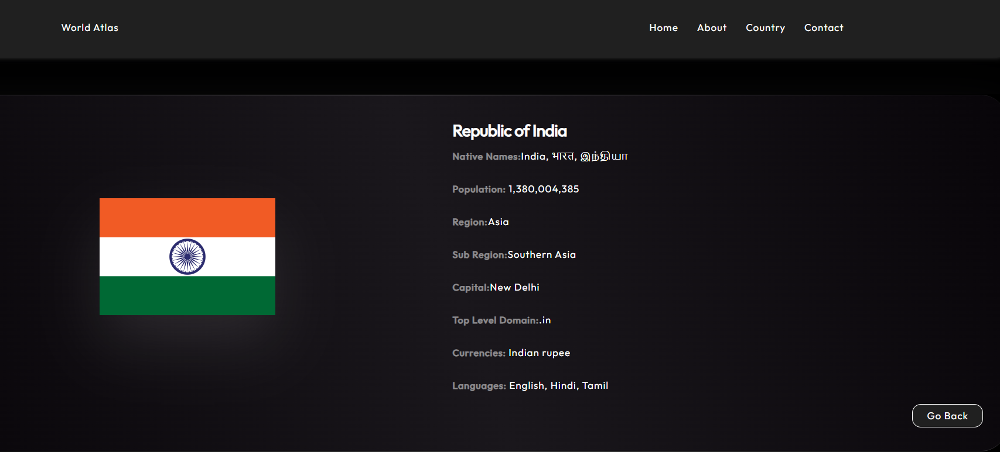

# GlobeHub 🌍

An interactive web app built with **React 19** that provides detailed information about countries around the world, offering insights into geography, culture, economy, and more.

## Features ✨
- Explore information on countries
- Interactive user interface built with React 19
- Fast and responsive design
- Search and filter countries easily
- interactive UI
  
## Click to visit 😊
Try viewing at 75% of screen resolution for an interactive viewing.

[Click Here .......](https://globehub.netlify.app/)
## 📸 Screenshots

### Home Page

### Country Details Page

### Search Feature

